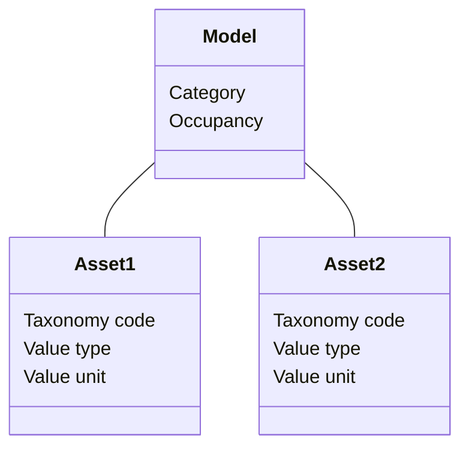

# Exposure
## Schema attributes

The exposure schema covers a wide variety of data describing structural, infrastructural and environmental asset, population, and socio-economic descriptors, each with relevant attributes for assessing risk from multiple hazards. The schema was developed based on [GEM Taxonomy 2.0](https://wiki.openstreetmap.org/wiki/GED4ALL) to accommodate the most important spatial features commonly employed in risk analysis to identify and estimate exposed value. 

The main features of an exposure dataset are specified by the **exposure model** attributes.
Each exposure model includes one or more **assets**. Each asset could represent a single asset (e.g. one building) or a collection of assets (e.g aggregated buildings in an area). 
The exposure schema covers 4 categories and 11 occupancy types for consistent classification of assets across schema. The taxonomy source specifies the taxonomy string used to identify individual asset features within a dataset. Occupancy can be optionally assigned for night-time or day-time, e.g. to discern resident population from daily commuters.

|**Required**| **Attribute** | **Description** | **Type** |
|:---:| --- | --- | --- |
|*| Category | Type of asset | <ul><li>Buildings<li>Indicators<li>Infrastructures<li>Crops, livestock and forestry</ul> |
|*| Occupancy | Destination of use of the asset | <ul><li>Residential<li>Commercial<li>Industrial<li>Infrastructure<li>Healthcare<li>Educational<li>Government<li>Crop<li>Livestock<li>Forestry<li>Mixed</ul> |
| | Occupancy time | Period of occupancy | <ul><li>Night<li>Day |
| | Taxonomy source | Name of adopted taxonomy model | Text |
| | Taxonomy code | String used by the taxonomy model to identify specific asset features | Text |
|*| Value type | Element to which value refers | <ul><li>Structure<li>Content<li>Product<li>Other</ul> |
|*| Value unit | Unit to measure exposed value | Unit code |

 Within one exposure model (e.g. one geospatial layer) there can be one or more **cost type** associated with damage to assets. For example, the cost of the building structure by square meter and the cost of the contents of a single building. The attributes are named accordingly within the datase, e.g. "Cost_structure" and "Cost_content".
Additional **tags** attributes can be associated with an asset to link any information not envised in the exposure schema.

##Examples

Exposure data can be stored at multiple scales, more often using vectors, namely polygons (e.g. building footprint), points (e.g. asset geolocation) and lines (e.g. transport infrastructures, lifelines), but in same case exposure estimates are aggregated at ADM level or distributed over a raster grid.

###Exposure map for Kabul

Text

|**Required**| **Attribute** | **Example** |
|:---:| --- | --- |
|*| Hazard type | Flood |
|*| Analysis type | Probabilistic |
|*| Calculation method | Simulated |
|| Geographic area | Kabul |
|| Frequency type | Return Period |
|| occurrence probability | 100 years |
|| Occurence time (start) | 1958 |
|| Occurence time (end) | 2001 |
|| Occurence time (span) | 44 years |
|*| Hazard process | River flood |
|*| Unit of measure | Water depth (m) |

 

