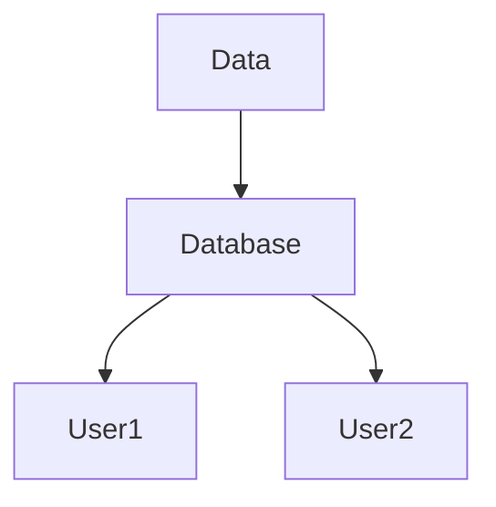

# Key concepts

## What is risk data

(adapted from "Understanding in risk in an evolving world, World Bank, 2014")

Explain in detail:

- hazard
- exposure
- vulnerability
- loss > explain how "loss" is related to risk

 
### How risk data is commonly produced and used?

Visual examples?
Diagram

 
## Risk Terminology

Definitions from glossary (only risk-related)

## Background documentation

on the main website or other sources

 
