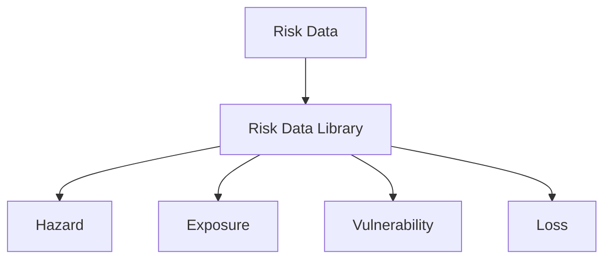

# DATABASE SCHEMA OVERVIEW

The Risk schema includes four components:

- **Hazard**: describes hazard scenario footprints and return period hazard maps 
- **Exposure**: describes exposed assets and population
- **Vulnerability**: describes physical vulnerbaility, fragility and damage-to-loss models
- **Loss**: describes modelled damage and losses produced in a risk assessment


```
high-level simplified UML-style diagram that focuses on the core relationships between entities,
rather than listing all of their attributes. This helps to put the various entities in context. 
a description of how the key elements of the model fit together, with pointers to the detailed sections.
```



<br>
##Dataset general attributes

In addition to schema-specific attributes, each dataset is identified by a list of attributes based on <a href="https://www.dublincore.org/specifications/dublin-core/dcmi-terms">DublinCore metadata standard</a>.

| **Required** | **Attribute** | **Description** | **Type** |
|:---:|---|---|---|
|*| component | Schema to be used | <ul><li>Hazard<li>Exposure<li>Vulnerability<li>Loss |
|*| Source model | Name of source model | Text |
|*| Release date | Model release date | Date |
| | Project name | Project under which data has been produced | Text |
| | Purpose | Purpose for what the data has been produced | Text |
| | Notes | Additional details about the dataset | Text |
| | Bibliography | Author, titles and publication year of documents containing relevant information on the dataset | Authors (Year) - Title; URL |
| | Version | Version of the dataset | Number  |
|*| Geo coverage | ISO code(s) of countries covered | ISOa3 country code |
|*| License code | Type of license | Licensing options |

<br><hr>
