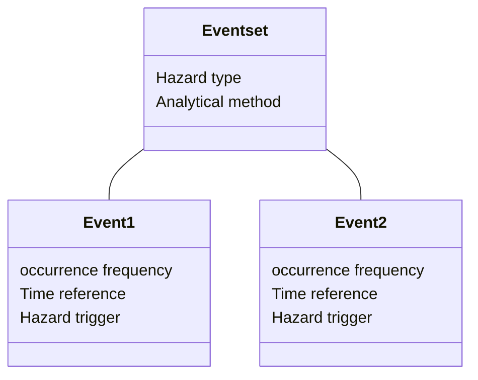

# Vulnerability
## Schema attributes

The hazard schema stores ...

 
The schema specifies which type of analysis and data methodology that has generated the dataset. It supports either simulated probabilistic scenarios and empirical observations. If the dataset has been produced for a specific location, such a city, the name of the location can be included.

|**Required**| **Attribute** | **Description** | **Type** |
|:---:| --- | --- | --- |
|*| Hazard type | Main hazard type from list of options | <ul><li>Coastal Flood<li>Convective Storm<li>Drought<li>Earthquake<li>Extreme Temperature<li>Flood<li>Landslide<li>Tsunami<li>Volcanic<li>Wildfire<li>Strong Wind<li>Multi-Hazard</ul> |
|*| Analysis type | Type of analysis that generated the data | <ul><li>Deterministic<li>Probabilistic |
|*| Calculation method | The methodology used for the modelling of hazard | <ul><li>Simulated<li>Observed<li>Inferred |
|| Geographic area | Specific location for which the dataset has been developed | Name of location |

 

 

 

<b>4.Vulnerability attributes</b>
 

The vulnerability schema includes physical fragility and vulnerability relationships in relation to specific hazards or for multi-hazard.
The schema distinguishes key information describing the function, including: 
- function type (i.e fragility, vulnerability, damage-to-loss); 
- ountries the function was developed for, measured in terms of to geographic relevance.
- development approach (empirical, analytical, judgement, hybrid, code-based); 
- mathematical model used (including exponential, cumulative lognormal/normal); 
- the intensity measure and asset type the function relates to; 
- loss parameter / engineering demand parameter values. 

The schema consists of three base tables (_f\_core_, _f\_specifics_, and _f\_additional_) and 
five supporting tables (_f\_scoring, damage\_scale, edp\_table, lp\_table, reference\_table_). 

The **core** attributes comprises data required by a user to correctly use the function, its scientific score and its applicability.
Separate entries are made for fragility functions associated with different damage states. 
The data schema permits recording of the functional form and parameters of fragility functions, but is also flexible enough to also allow the entry of discrete forms of fragility representation, i.e. damage probability matrices (DPM).

| | **Field name** | **Description** | **Example** |
|:---:| --- | --- | --- | 
| * | hazard\_type\_primary | Primary hazard involved | EQ |
| | hazard\_type\_secondary  | Secondary hazard involved | TS |
| *| process\_type\_primary | Primary process involved | |
| | process\_type\_secondary | Secondary process involved | |
| * | occupancy |  Type of occupancy | Residential |
| | taxonomy\_source | Source of taxonomy | |
| | taxonomy | Name of taxonomy | |
| * | asset\_type | Type of asset | |
| | asset\_notes | Additional info on asset | |
| * | country\_iso | ISO country code(s), comma separated | ITA, FRA, GER |
| | applicability\_notes | Specific sub-area within a country and/or region. | |
| * | scale\_applicability | Administrative level of application | |
| * | function\_type | Type of function | Fragility |
| | approach | Type of methodological approach | |
| * | | _mover.f\_relationship\_enum_ | Type of relationship | Mathematical |
| | f\_math | Type of math reference ?? | Parametric |
| | f\_math\_model | Type of mathematical model | |
| | bespoke\_model\_ref | Reference study of the bespoke model | |
| * | f\_reference | Literature article or report | |
| * | licence\_code | Type of licence | |
| | licence\_reference | Url associated with licence | |

The **f\_specifics** attributes add more optional details.

| | **Field name** | **Description** | **Example** |
|:---:| --- | --- | --- | 
| | par\_names | Parameters values names | MIDR , Ash depth | |
| | ub\_par\_value | Upper bound parameters value (Value1; Value2) | |
| | ub\_par\_perc | Upper bound parameters percentiles (Perc1; Perc2) | |
| | med\_par\_value | Median parameter values (Med1; Med2) | |
| | lb\_par\_value | Lower bound parameters value (Value1; Value2) | |
| | lb\_par\_perc | Lower bound parameters percentiles (Perc 1;Perc 2) | |
| | damage\_scale\_code | Code that identifies the damage scale | |
| | dm\_state\_name | Damage states studied in the reference study of the function | |
| | n\_dm\_states | Number of damage states studied in the reference study of the function | |
| | f\_disc\_im | Intensity measure values for the characterization of discrete functions | |
| | f\_disc\_ep | This field lists the associated exceeded probability values to the IM values of the previous field | |
| | lp\_code |  |  |
| | lp\_loss\_value | | |
| | edp\_cpde | Code related to specific engineering demand parameter (EDP) used to the DS thresholds | |
| | edp\_name | Specific engineering demand parameter (EDP) used to the DS thresholds | |
| | edp\_dmstate\_thre | Specific damage state EDP threshold | | 
| | im\_code | Code of intensity measure | |
| | im\_name | Name of intensity measure | |
| | im\_range | Range of intensity measures as min;max (e.g. 0;500) | |
| | im\_units | Unit of intensity measrue | |
| | im\_method | Type of source of the im data | |
| | im\_sim\_type | Type of simulation, Physics-based or IMPE | |
| | impe\_referenec | Reference study of the IMPE simulation | |
| | data\_countries | ISO code(s) of countries to which data refer | |
| | im\_data\_source | Reference studies for the IM data sources | |
| | n\_events | Number of events the function has been built on | |
| | n\_assets | INumber of assets the function has been built on | |

The **f\_additional** attributes cover more specific information that helps to understand the analysis which generated the function.

| | **Field name** | **Description** | **Example** |
|:---:| --- | --- | --- |
| * | nonsampling\_err | Is there sampling error? | NO |
| | type\_nonsampling\_err | Type of non sampling error | |
| | is\_fix\_nonsam\_err | Has non sampling error being fixed? | TRUE |
| | is\_data\_aggregated | Has data been aggregated? | FALSE |
| | is\_data\_disaggr | Has data been disaggregated? | TRUE |
| | n\_data\_points\_aggr | Number of aggregated data points used for the evaluation of data quality | 600 |
| | an\_analysis\_type | Type of analysis for Analytical functions | |
| | em\_analysis\_type | Type of analysis for Empirical functions | |
| | jd\_analysis\_type | Type of analysis for Judgement functions | |
| | is\_fit\_good | Is the fit good overall? | TRUE |
| | fit\_ref | Reference model for fitting |
| | val\_data\_source | If validation has been done, source of the independent data | |
| | val\_study\_reference | Reference of the Validation study | |
| | sample | Type of sampling | |

 

 

 

The vulnerability schema includes physical fragility and vulnerability relationships (single and multi-hazard curves) and will be extended to include socioeconomic indicators and indexes. 
The schema distinguishes key information describing the function, including: 
- function type (i.e fragility, vulnerability, damage-to-loss); 
- development approach (empirical, analytical, judgement, hybrid, code-based); 
- mathematical model used (including exponential, cumulative lognormal/normal); 
- the intensity measure and asset type the function relates to; 
- loss parameter / engineering demand parameter values. 

It also defines the countries for which the function was developed, to provide guidance on geographic relevance when applying a function. 
All data is stored with metadata focussed on providing the information required to assess its suitably for risk modelling projects - 
including source, licence, development method, units, and hazard processes it relates to.

The schema consists of three base tables (_f\_core_, _f\_specifics_, and _f\_additional_) and 
five supporting tables (_f\_scoring, damage\_scale, edp\_table, lp\_table, reference\_table_). 
The vulnerbaility schema is linked to the _cf\_Common_ tables, which contain supports consistency across the four schema.

ERD (vulnerability schema): vulnerability table contents (purple) and links to common tables (yellow).
 
###Table: _mover.f\_core_

The _f\_core_ table comprises data fields for recording all necessary fragility function attributes required by a user to reproduce the function. 
It also comprises fields that contain useful information for the scoring the fragility functions (which can be recorded in the _f\_scoring_ table). 
Separate entries are made for fragility functions associated with different damage states. 
The data schema permits recording of the functional form and parameters of fragility functions, but is also flexible enough to also allow the entry of discrete forms of fragility representation, i.e. damage probability matrices (DPM).

| **Req** | **Field name** | **Type** | **Reference table** | **Description** |
|:---:| --- | --- | --- | --- |
| **\*** | id | INT | | Unique number ID |
| **\*** | hazard\_type\_primary | VARCHAR | _cf\_common.hazard\_type_ | Primary hazard involved |
| | hazard\_type\_secondary | VARCHAR | _cf\_common.hazard\_type_ | Secondary hazard involved |
| **\*** | process\_type\_primary | VARCHAR | _cf\_common.process\_type_ | Primary process involved |
| | process\_type\_secondary | VARCHAR | _cf\_common.process\_type_ | Secondary process involved |
| **\*** | occupancy | ENUM | _cf\_common.occupancy\_enum_ | Type of occupancy |
| | taxonomy\_source | VARCHAR | | Source of taxonomy |
| | taxonomy | VARCHAR | | Name of taxonomy |
| **\*** | asset\_type | VARCHAR | _ged4all.asset_ | Type of asset |
| | asset\_notes | VARCHAR | | Additional info on asset |
| **\*** | country\_iso | VARCHAR | | 3-char country code(s), comma separated |
| | applicability\_notes | VARCHAR | | Specific sub-area within a country and/or region. |
| **\*** | scale\_applicability | ENUM | _mover.scale\_app\_enum_ | Administrative level of application |
| **\*** | function\_type | ENUM | _mover.function\_type\_enum_ | Type of function: Fragility or Vulnerability or Damaga-to-loss |
| | approach | ENUM | _mover.f\_subtype\_enum_ | Type of methodological approach |
| **\*** | f\_relationship | ENUM | _mover.f\_relationship\_enum_ | Type of relationship: Mathematical or Discrete |
| | f\_math | ENUM | _mover.f\_math\_enum_ | Parametric or bespoke |
| | f\_math\_model | ENUM | _mover.f\_mathtype\_enum_ | Type of mathematical model |
| | bespoke\_model\_ref | VARCHAR | | Reference study of the bespoke model |
| **\*** | f\_reference | VARCHAR | | Literature article or report |
| **\*** | licence\_code | VARCHAR | _cf\_common.license_ | Type of licence |
| | licence\_reference | VARCHAR | | Url associated with licence |

 
###Table: _mover.f\_specifics_

The _f\_specifics_ table comprises data fields for recording specific optional details of the fragility function. 

| **Req** | **Field name** | **Type** | **Reference table** | **Description** |
|:---:| --- | --- | --- | --- |
| **\*** | f\_specifics\_id | INT | | Unique number ID |
| | par\_names | VARCHAR | | Parameters values names Example: MIDR , Ash depth |
| | ub\_par\_value | VARCHAR | | Upper bound parameters value (Value1; Value2) |
| | ub\_par\_perc | VARCHAR | | Upper bound parameters percentiles (Perc1; Perc2) |
| | med\_par\_value | VARCHAR | | Median parameter values (Med1; Med2) |
| | lb\_par\_value | VARCHAR | | Lower bound parameters value (Value1; Value2) |
| | lb\_par\_perc | VARCHAR | | Lower bound parameters percentiles (Perc 1;Perc 2) |
| | damage\_scale\_code | VARCHAR | | Code that identifies the damage scale |
| | dm\_state\_name | ENUM | _mover.damage\_states\_all\_enum_ | Damage states studied in the reference study of the function |
| | n\_dm\_states | CHAR(1) | | Number of damage states studied in the reference study of the function |
| | f\_disc\_im | VARCHAR | | Intensity measure values for the characterization of discrete functions |
| | f\_disc\_ep | VARCHAR | | This field lists the associated exceeded probability values to the IM values of the previous field |
| | lp\_code | VARCHAR | |  |
| | lp\_loss\_value | VARCHAR | | |
| | edp\_cpde | VARCHAR | | Code related to specific engineering demand parameter (EDP) used to the DS thresholds |
| | edp\_name | VARCHAR | | Specific engineering demand parameter (EDP) used to the DS thresholds |
| | edp\_dmstate\_thre | VARCHAR | | Specific damage state EDP threshold |
| | im\_code | VARCHAR | | Code of intensity measure |
| | im\_name | VARCHAR | | Name of intensity measure |
| | im\_range | VARCHAR | | Range of intensity measures as min;max (e.g. 0;500) |
| | im\_units | VARCHAR | | Unit of intensity measrue |
| | im\_method | ENUM | _mover.im\_method\_enum_ | Type of source of the im data |
| | im\_sim\_type | ENUM | _mover.sim\_method\_enum_ | Type of simulation, Physics-based or IMPE |
| | impe\_referenec | VARCHAR | | Reference study of the IMPE simulation |
| | data\_countries | VARCHAR | | ISO code(s) of countries to which data refer |
| | im\_data\_source | VARCHAR | | Reference studies for the IM data sources |
| | n\_events | INT | | Number of events the function has been built on |
| | n\_assets | INT | | Number of assets the function has been built on |

 
###Table: _mover.f\_additional_

The _f\_additional_ table comprises data fields for recording additional, optional specific attributes of the fragility function that helps to understand the analysis which generated the function.

| **Req** | **Field name** | **Type** | **Reference table** | **Description** |
|:---:| --- | --- | --- | --- |
| **\*** | f\_additional\_id | INT | | Unique number ID |
| **\*** | nonsampling\_err | ENUM | _mover.nonsampling\_err\_enum_ | Is there sampling error? |
| | type\_nonsampling\_err | ENUM | _mover.type\_nonsampling\_err\_enum_ | Type of non sampling error |
| | is\_fix\_nonsam\_err | BOOLEAN | | Has non sampling error being fixed? |
| | is\_data\_aggregated | BOOLEAN | | Has data been aggregated? |
| | n\_data\_points\_aggr | INT | | Number of aggregated data points used for the evaluation of data quality |
| | is\_data\_disaggr | BOOLEAN | | Has data been disaggregated? |
| | an\_analysis\_type | ENUM | _mover.an\_analysis\_type\_enum_ | Type of analysis for Analytical functions |
| | em\_analysis\_type | ENUM | _mover.em\_analysis\_type\_enum_ | Type of analysis for Empirical functions |
| | jd\_analysis\_type | ENUM | _mover.jd\_analysis\_type\_enum_ | Type of analysis for Judgement functions |
| | is\_fit\_good | BOOLEAN | | Is the fit good overall? |
| | fit\_ref | ENUM | _mover.fit\_ref\_enum_ | Reference model for fitting |
| | val\_data\_source | VARCHAR | | If validation has been done, source of the independent data |
| | val\_study\_reference | VARCHAR | | Reference of the Validation study |
| | sample | ENUM | _mover.sample\_enum_ | Type of sampling |

 
###Table: _mover.f\_scoring_

The f\_scoring_ table provides a recording and scoring geogrpahic relevance of vulnerability and fragility functions to one or more countries - i.e. a function developed for a particular country is highly relevant for that country and less relevant for other countries where the building stock differs.

| **Req** | **Field name** | **Type** | **Reference table** | **Description** |
|:---:| --- | --- | --- | --- |
| **\*** | id | INT | | Unique number ID |
| **\*** | f\_core\_id | INT | _mover.f_core_ | ID of the function |
| **\*** | geo\_applicability | VARCHAR | | ISO code(s) of countries to which the data applies. Can be different from countries of model development, has associated score of geographic relevance |
| **\*** | geographic\_relevance\_score | ENUM | mover.geographic\_relevance\_score\_enum | How well the data applies to the countries of application |

 
###Table: _mover.damage\_scale_

The damage\_scale_ table provides details on damage scales. The dm\_scale_ table is called upon by the Fragility Function module.

| **Req** | **Field name** | **Type** | **Reference table** | **Description** |
|:---:| --- | --- | --- | --- |
| **\*** | id | INT | | Unique number ID |
| | asset\_type | VARCHAR | ged4all.asset | Type of asset |
| | occupancy | ENUM | cf\_common.occupancy\_enum | Type of occupancy |
| | hazard\_type | VARCHAR | cf\_common.hazard\_type | Type of hazard |
| | process\_type | VARCHAR | cf\_common.process\_type | Type of hazard process |
| | asset\_notes | VARCHAR | | Additional info on asset |
| | taxonomy\_source | VARCHAR | | Source of taxonomy |
| | taxonomy | VARCHAR | | Name of taxonomy |
| **\*** | n\_dm\_states | CHAR(1) | | Number of damage states that the damage scale studies |
| **\*** | dm\_states\_id | VARCHAR | | Lists all the damage states as they are identified in the specific damage scale, e.g. 1;2;3;4 |
| **\*** | dm\_states\_name | VARCHAR | | List all damage states names as they are identified in the specific damage scale, e.g. 1;2;3;4. Different damage scales will have different names associated to a damage state |
| | damage\_scale\_name | VARCHAR | | Name of the damage scale in use |
| | damage\_scale\_code | VARCHAR | | Code to identify the damage scale |
| | damage\_scale\_type | ENUM | mover.dm\_scale\_ty\_enum | Type of damage scale in use |
| | dm\_scale\_reference | VARCHAR | | Reference study of the damage scale (Author\_Years e.g. Crowley et al\_2004) |
| **\*** | is\_edp\_thre | BOOLEAN | | Is the damage scale is associated to an EDP threshold? |
| **\*** | is\_dm\_factor | BOOLEAN | | Is the damage scale is associated to a damage factor? |
| **\*** | is\_casualties | BOOLEAN | | Is the damage scale is associated to a casualties estimation? |
| **\*** | is\_downtime | BOOLEAN | | Is the damage scale is associated to a downtime estimation (e.g. service interruption)? |

 
###Table: _mover.edp\_table_

The edp\_table provides details of Engineering Demand Parameters (EDP) for analytical fragility functions. The edp\_table is called upon by the Fragility Function module. 
In analytical approaches, Engineering Demand Parameters (EDP) are typically used as a proxy of damage level, with EDPs chosen such that they are indicative of the damage state of the entire asset. 
For instance, in earthquake engineering ranges of values of roof drift or inter-storey drift are commonly adopted to represent specific damage states.

| **Req** | **Field name** | **Type** | **Reference table** | **Description** |
|:---:| --- | --- | --- | --- |
| **\*** | edp\_code | VARCHAR | | Unique alphanumeric code |
| | edp\_name | VARCHAR | | Engineering Demand Parameter (EDP) name (e.g. peak flow acceleration) |
| **\*** | description | VARCHAR | | Engineering Demand Parameter (EDP) description |
| | units | VARCHAR | | Unit of measure of the EDP |

 
###Table: _mover.lp\_table_
The lp\_table_ describes Loss Parameters (LP) and the units used to describe the loss in a vulnerability curve.

| **Req** | **Field name** | **Type** | **Reference table** | **Description** |
|:---:| --- | --- | --- | --- |
| **\*** | lp\_code | VARCHAR | | Loss parameter unique code |
| | lp\_name | VARCHAR | | Loss parameter name |
| **\*** | description | VARCHAR | | Loss parameter description |
| | units | VARCHAR | | Unit of measure of the LP |

 
###Table: _mover.reference\_table_

The reference\_table_ stores all the information necessary to identify reference studies associated to the functions, damage scales, and intensity measures contained in the schema. 
It is designed to provide the user with a complete bibliography of the reference studies consulted during the data entry process.

| **Req** | **Field name** | **Type** | **Reference table** | **Description** |
|:---:| --- | --- | --- | --- |
| **\*** | author\_year | VARCHAR | | Reference study of the damage scale (Author\_Year e.g. Crowley et al\_2004) |
| **\*** | title | VARCHAR | | Title of the publication |
| | issn | VARCHAR | | International Standard Serial Number associated with reference |
| | doi | VARCHAR | | Digital Object Identifier url associated with reference |

 
###Types

Includes 17 types related to the definitions and formulas of IM, damage scales, EDPs, and loss parameters are provided in the following sections to facilitate data entry, as these are adopted in pre-populated drop-down menus. Some sub-types apply only to certain main types.

| **ENUM name** | Types | Description |
| --- | --- | --- |
| function\_type\_enum | <ul><li>Fragility<li>Vulnerability<li>Damage-to-Loss | Type of function |
| f\_relationship\_enum | <ul><li>Mathematical<li>Discrete | Type of relationship |
| f\_subtype\_enum | <ul><li>Empirical<li>Analytical<li>Judgement<li>Hybrid - Analytical/Empirical<li>Hybrid - Analytical/Judgement<li>Hybrid - Empirical/Judgement<li>Hybrid - Analytical HF/LF<li>Code - based | Approach used to build the function  Note: HF = High Fidelity LF = Low Fidelity|
| im\_method\_enum | <ul><li>Recorded<li>Surveyed<li>Simulated<li>Unknown | Method for collecting the intensity measure |
| an\_analysis\_type\_enum | <ul><li>Advanced<li>Simplified<li>N/a | Type of analysis for Analytical functions |
| em\_analysis\_type\_enum | <ul><li>Least squares<li>GLM<li>GAM<li>N/a | Type of analysis for Empirical functions |
| f\_math\_enum | <ul><li>Parametric<li>Bespoke<li>N/a | Types of models that apply to Empirical functions |
| jd\_analysis\_type\_enum | <ul><li>Delphi<li>Cookes<li>N/a | Type of analysis for Judgment functions |
| f\_mathtype\_enum | <ul><li>Cumulative Lognormal<li>Cumulative Normal<li>Exponential<li>Bespoke<li>DtL - Beta PDF<li>DtL - Normal PDF<li>DtL - Lognormal PDF<li>DtL - Uniform PDF<li>DtL - Bespoke PDF<li>N/a | Mathematical model utilized for the derivation of the function  Note: Dtl = Damage-to-loss |
| sim\_method\_enum | <ul><li>Physics-based<li>IMPE | Type of simulation |
| dm\_scale\_ty\_enum | <ul><li>Existing<li>Bespoke<li>Unknown | Type of damage scale |
| fit\_ref\_enum | <ul><li>AIC<li>BIC<li>Kolmogorov-Smirnov | Reference model for fitting |
| scale\_app\_enum | <ul><li>Country (Level 0)<li>Sub-country (Level 1)<li>Local (Level 2)<li>Asset (Level 3) | Geographic scale applicability|
| geographic\_relevance\_score | <ul><li>Excellent<li>Good<li>Needs improvement<li>Unusable | Overall performance quality for geographic context |
| sample\_enum | <ul><li>Single-asset class<li>Multi-assets classes<li>Single-asset | Type of sampling approach |
| nonsampling\_err\_enum | <ul><li>Yes<li>No<li>Unknown | Is there a non-sampling error? |
| type\_nonsampling\_err\_enum | <ul><li>Under coverage<li>Incomplete data<li>Measurement error<li>Unknown | Type of non-sampling error |
| damage\_states\_all\_enum | <ul><li>No damage<li>Light damage<li>Minor damage<li>Moderate damage<li>Major damage<li>Heavy damage<li>Complete damage<li>Collapsed<li>Washed away<li>Not applicable | Range of damage states  (DEV NOTE: supposedly to include all damage states from all functions included; this is not sustainable) |

 